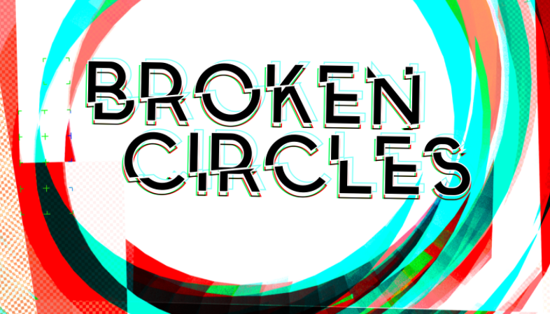

# About

Broken Circles is a data visualisation and consumer empowerment tool that takes data on the true and hidden costs of materials, manufacture, usage, and end of life costs, to make more fully informed choices possible. This is a Data Prototype project by the Organised Art Syndicate, funded by [SWCTN](https://www.swctn.org.uk/data/) (the South West Creative Technology Network).

Our prototype will support better public understanding of the hidden costs and consequences of our everyday choices. By casting a light on the data, connecting them meaningfully to common products, we can tell a more complete story about products, that is not included in the marketing copy. We are empowering citizens to make better choices for themselves and the planet. It will give users a wider-lens view on material, design, manufacture, transport, usage and waste issues and presenting this in a way that encourages awareness in consumers, and responsibility in the supply chain. It will link to social, well-being and health as well as environmental factors. 

The protoype aims to deliver data driven storytelling to allow citizens to understand the impact onf their choices, and find out where and how they have influence. This will take the form of web based interactive tools, a citizen toolkit, an interactive exhibit, and art.

